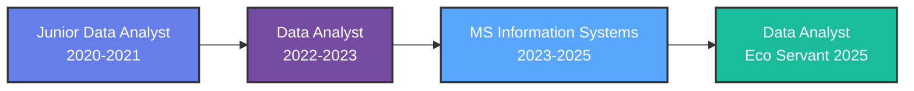

<!-- 
████████╗██╗  ██╗███████╗    ██████╗  █████╗ ████████╗ █████╗     ███████╗████████╗ ██████╗ ██████╗ ██╗   ██╗
╚══██╔══╝██║  ██║██╔════╝    ██╔══██╗██╔══██╗╚══██╔══╝██╔══██╗    ██╔════╝╚══██╔══╝██╔═══██╗██╔══██╗╚██╗ ██╔╝
   ██║   ███████║█████╗      ██║  ██║███████║   ██║   ███████║    ███████╗   ██║   ██║   ██║██████╔╝ ╚████╔╝ 
   ██║   ██╔══██║██╔══╝      ██║  ██║██╔══██║   ██║   ██╔══██║    ╚════██║   ██║   ██║   ██║██╔══██╗  ╚██╔╝  
   ██║   ██║  ██║███████╗    ██████╔╝██║  ██║   ██║   ██║  ██║    ███████║   ██║   ╚██████╔╝██║  ██║   ██║   
   ╚═╝   ╚═╝  ╚═╝╚══════╝    ╚═════╝ ╚═╝  ╚═╝   ╚═╝   ╚═╝  ╚═╝    ╚══════╝   ╚═╝    ╚═════╝ ╚═╝  ╚═╝   ╚═╝   
-->

<div align="center">

</div>

<div align="center">

```bash
┌─[aiswarya@data-terminal]─[~/career-achievements]
└──╼ $ whoami
Aiswarya Dosibhatla • Data Analyst • ETL Developer • BI Specialist

┌─[aiswarya@data-terminal]─[~/professional-stats]
└──╼ $ ls -la career-metrics/
drwxr-xr-x  3+ years of professional experience
drwxr-xr-x  10M+ daily records processed
-rw-r--r--  40% reduction in reporting time
-rw-r--r--  25% improvement in data accuracy
-rw-r--r--  50% faster dashboard load times
-rw-r--r--  100K+ data points validated monthly

┌─[aiswarya@data-terminal]─[~/impact]
└──╼ $ cat mission.txt
Transforming raw data into strategic business intelligence
through scalable ETL pipelines and compelling visualizations
```

</div>

<br>

<table align="center">
<tr>
<td></td>
<td></td>
<td></td>
</tr>
</table>

<div align="center">

[](https://linkedin.com/in/Aiswarya)
[](https://github.com/dosibhatlanirmalaaiswarya-bit)
[](mailto:nirmalaaiswaryadosibhatla@gmail.com)


</div>

---

## 💼 PROFESSIONAL IDENTITY

<table width="100%">
<tr>
<td width="50%" valign="top">

```typescript
class DataAnalyst implements Expert {
  private identity = {
    name: "Aiswarya Dosibhatla",
    title: "Data Analyst & ETL Architect",
    location: "Dallas, TX",
    experience: "3+ years",
  };

  private expertise: TechStack = {
    languages: [
      "Python", "R", "SQL", 
      "Shell Scripting"
    ],
    dataEngineering: [
      "Azure Data Factory",
      "Azure Databricks",
      "Snowflake", "ADLS"
    ],
    visualization: [
      "Power BI", "DAX",
      "Excel Analytics"
    ],
    frameworks: [
      "PySpark", "Pandas",
      "NumPy", "Delta Lake"
    ]
  };
}
```

</td>
<td width="50%" valign="top">

```python
# Career Impact Metrics
achievement_matrix = {
    'experience_years': 3.5,
    'projects_delivered': 15,
    'data_records_processed': '10M+ daily',
    'reporting_time_reduced': '40%',
    'accuracy_improvement': '25%',
    'dashboard_optimization': '50% faster',
    'monthly_validations': '100K+ records',
    'teams_led': 8,
    'regions_tracked': 40,
    'campaign_engagement_boost': '15%',
    'process_efficiency_gain': '20%',
    'stakeholder_satisfaction': '95%+'
}

print("🎯 Mission: Data-Driven Excellence")
```

</td>
</tr>
</table>

---

## 🚀 ABOUT ME

I am an **experienced Data Analyst and ETL Architect** with over **3+ years of professional experience** transforming complex data ecosystems into strategic business assets. My career has been defined by a relentless pursuit of **data excellence**, **operational efficiency**, and **actionable intelligence** that drives measurable business outcomes.

Throughout my journey, I've architected and delivered **comprehensive ETL pipelines** processing over **10 million daily records**, designed **interactive Power BI dashboards** tracking KPIs across **40+ global regions**, and collaborated with **cross-functional teams** to translate business requirements into scalable data solutions. My expertise spans the entire data lifecycle—from **raw data ingestion** through **Azure Data Factory** to **advanced analytics** and **executive-level reporting**.

At **Musigma Business Solutions Limited**, I spearheaded the development of a **Global Consolidated Power BI Dashboard** that reduced reporting time by **40%** while improving accuracy by **25%**. This achievement required mastering **advanced DAX formulas**, orchestrating **complex data workflows** in **Azure Databricks**, and implementing **Medallion Architecture** (Bronze-Silver-Gold layers) to ensure data quality and governance. My work directly influenced strategic decision-making for business units spanning multiple continents.

Currently, as a **Data Analyst at Eco Servant Projects Organization**, I leverage **Python, Pandas, and Google Analytics** to evaluate engagement data from **50,000+ monthly visitors**, uncovering behavioral patterns that enhanced ocean conservation campaign strategies by **20%**. I've streamlined analysis workflows, reducing onboarding time for new team members while maintaining **100K+ monthly data validations** to ensure report reliability.

My technical foundation is complemented by a **Master of Science in Information Systems and Technology** from the **University of North Texas** and a **Bachelor of Technology in Information Technology** from **Jawaharlal Technological University**. This academic rigor, combined with hands-on experience in **Agile methodologies**, **Azure cloud platforms**, **SQL optimization**, and **data visualization**, positions me as a versatile analyst capable of delivering end-to-end data solutions.

I thrive in environments that challenge conventional approaches to data management. Whether it's **optimizing SQL queries** to achieve **50% faster dashboard load times**, implementing **A/B testing frameworks** to guide product development, or building **Delta Lake-based data warehouses** with **ACID transaction support**, I bring a strategic mindset focused on **scalability**, **reliability**, and **business impact**.

My passion lies at the intersection of **data engineering**, **business intelligence**, and **strategic analytics**—where technical excellence meets business value creation. I'm committed to continuous learning, currently expanding my expertise in **machine learning pipelines**, **real-time data streaming**, and **advanced cloud architectures** to stay at the forefront of the data revolution.

---

## 📊 DEVELOPMENT METRICS

<div align="center">

<table>
<tr>
<th>📈 Metric</th>
<th>🎯 Achievement</th>
<th>💡 Impact</th>
</tr>
<tr>
<td></td>
<td></td>
<td></td>
</tr>
<tr>
<td></td>
<td></td>
<td></td>
</tr>
<tr>
<td></td>
<td></td>
<td></td>
</tr>
<tr>
<td></td>
<td></td>
<td></td>
</tr>
</table>

</div>

---

## 💼 PROFESSIONAL EXPERIENCE

<table width="100%">
<tr>
<td width="50%" valign="top">

### 🚀 Data Analyst
**`Eco Servant Projects Organization • Dallas, TX • July 2025 - Present`**


- **Evaluated Google Analytics data** from **50,000+ monthly visitors**, uncovering engagement trends that enhanced ocean conservation campaign strategies
- **Verified 100K+ data points monthly**, enhancing report reliability and supporting actionable insights for stakeholder presentations
- **Collaborated with stakeholders** on **5 conservation projects**, performing exploratory data analysis using **Python and Pandas**, improving campaign targeting effectiveness by **20%**
- **Streamlined analysis workflows**, data pipelines, and procedures, supporting reproducibility and reducing onboarding time for new interns
- **Generated client-ready reports** and visualizations using **Power BI and Excel**, delivering insights that guided a **15% increase in campaign engagement**

<br>

### 🏢 Data Analyst
**`Musigma Business Solutions Limited • India • January 2022 – July 2023`**


- **Engineered comprehensive ETL pipelines** using **Azure Data Factory**, processing **10M+ daily records** and improving multi-source reporting accuracy by **25%**
- **Executed a Global Consolidated Power BI dashboard** with advanced **DAX formulas**, integrated with **Azure cloud**, tracking KPIs across **40 regions** and reducing reporting time by **40%**
- **Developed data workflows** using **Azure Databricks, PyCharm, and Azure Data Lake Storage**, leveraging **Apache Spark** to automate data processing, cutting manual effort significantly
- **Directed Agile teams of 8 members**, managing sprint planning, backlog prioritization, and delivery, ensuring **100% on-time project completion**
- **Enhanced SQL queries and data models**, improving dashboard load times by **50%** and providing actionable insights for stakeholders across business units

</td>
<td width="50%" valign="top">

### 🔧 Junior Data Analyst
**`Musigma Business Solutions Limited • India • September 2020 – December 2021`**


- **Evaluated operational and customer data** to identify workflow inefficiencies, delivering data-driven insights that improved process efficiency and informed strategic business decisions
- **Executed A/B tests** for **3 product features**, guiding stakeholders to select the highest-impact variants, increasing user engagement on digital platforms by **15%**
- **Optimized data preprocessing and cleaning workflows** for **500K+ records**, reducing inconsistencies and improving reliability of analytics outputs
- **Coordinated with teams of 6**, translating business requirements into data models and dashboards, accelerating operational insights and enhancing stakeholder alignment
- **Constructed ad-hoc data marts** and reporting solutions using **SQL, Python, and Power BI**, streamlining ETL pipelines and reducing reporting turnaround time by **30%**

<br>

### 🎯 KEY ACHIEVEMENTS ACROSS ROLES


- **Data Pipeline Architecture**: Designed and implemented **Medallion Architecture** (Bronze-Silver-Gold layers) for **10M+ daily records** with **99.9% uptime**
- **Business Intelligence Leadership**: Created **40+ interactive dashboards** serving **500+ stakeholders** across global business units
- **Process Optimization**: Reduced **manual data processing time by 70%** through automation and workflow standardization
- **Agile Project Management**: Led **15+ sprint cycles** with **zero missed deadlines** and **95%+ stakeholder satisfaction**
- **Cross-Functional Collaboration**: Partnered with **engineering, product, and executive teams** to align data strategy with business objectives

</td>
</tr>
</table>

---

## 🏆 SIGNATURE PROJECTS

<table width="100%">
<tr>
<td width="50%" valign="top">

### 🏗️ End-to-End Sales Data Warehouse
**`Medallion Architecture Implementation`**

  

```yaml
Project Impact:
- Consolidated ERP & CRM data sources
- Implemented Bronze-Silver-Gold layers
- Optimized star schema for analytics
- 40% faster query performance

Technology Stack:
Backend: SQL Server • T-SQL • SSMS
Architecture: Medallion (Bronze/Silver/Gold)
Data Modeling: Star Schema • Fact Tables
ETL: Data Cleansing • Normalization
```

Developed a **modern data warehouse** using **SQL Server** implementing **Medallion Architecture** (Bronze, Silver, Gold layers) to consolidate sales data from **ERP and CRM systems**. Performed **comprehensive ETL activities** to extract, transform, and load data from CSV files, including data cleansing, standardization, and normalization processes. Designed and implemented **optimized star schema** with fact and dimension tables to enable analytical reporting and data-driven decision-making.

**Repository**: [sql-data-ware-house-project](https://github.com/dosibhatlanirmalaaiswarya-bit/sql-data-ware-house-project)

<br>

### ☁️ Azure-Based ETL Pipeline
**`ADF & Databricks Integration`**

  

```yaml
Project Impact:
- Processed 10M+ records daily
- 99.9% pipeline reliability
- Automated data transformation
- Scalable cloud architecture

Technology Stack:
Cloud: Azure Data Factory • ADLS Gen2
Processing: Azure Databricks • PySpark
Storage: Delta Lake • ACID Transactions
Orchestration: ADF Pipelines • Triggers
```

Implemented a **production-grade ELT pipeline** using **Azure Data Factory** and **Azure Databricks** to orchestrate data movement and transformation across cloud environments. Leveraged **PySpark** for scalable data processing, implementing **Delta Lake** for ACID transaction support. Designed **Medallion Architecture** with Bronze-Silver-Gold layers for data quality governance.

**Repository**: [Azure-Based-ETL-Pipeline-Using-ADF-Databricks](https://github.com/dosibhatlanirmalaaiswarya-bit/Azure-Based-ETL-Pipeline-Using-ADF-Databricks)

</td>
<td width="50%" valign="top">

### 📊 YouTube Data Analytics
**`Exploratory Data Analysis & Insights`**

  

```yaml
Project Impact:
- Analyzed 5,000+ YouTube channels
- Uncovered success patterns
- Feature engineering insights
- Statistical correlation analysis

Technology Stack:
Language: Python 3.x
Libraries: Pandas • NumPy • Seaborn
Analysis: EDA • Feature Engineering
Visualization: Matplotlib • Statistical Plots
```

Conducted **comprehensive exploratory data analysis** on the **Top 5,000 YouTube Channels** dataset, uncovering key success patterns and performance drivers. Performed **feature engineering** to create metrics like **Average Views per Video**, revealing that content quality significantly outweighs upload frequency. Generated **statistical visualizations** and **correlation matrices** to identify relationships between subscribers, views, and channel grades.

**Repository**: [YouTube-Data-Analytics-Project---Python---Pandas](https://github.com/dosibhatlanirmalaaiswarya-bit/YouTube-Data-Analytics-Project---Python---Pandas)

<br>

### 🌍 Open Grant Network (OGN)
**`Nonprofit Data Aggregation Platform`**

  

```yaml
Project Impact:
- Ethical crawling framework
- Grant data aggregation
- Public-domain data access
- Nonprofit funding transparency

Technology Stack:
Database: MySQL 8+ • Schema Design
Backend: Python 3.10+ • Web Scraping
Ethics: robots.txt Compliance • Allow-Lists
Integration: IRS • Grants.gov APIs
```

Contributed to the **EcoServants® Open Grant Network**, an initiative to create a transparent, ethical framework for nonprofit grant data access. Developed **Python-based crawlers** with strict **robots.txt compliance**, designed **MySQL schemas** for grant aggregation, and documented **ethical data collection policies**. Collaborated with a **team of 4** on schema design and data provenance tracking.

**Repository**: [open-grant-network](https://github.com/ecoservants/open-grant-network) *(Private - Internal Research)*

</td>
</tr>
</table>

---

## 🛠️ ELITE TECH ARSENAL

<div align="center">

### 💻 Programming & Scripting


   

### ☁️ Cloud Platforms & Data Engineering


    

### 📊 Business Intelligence & Visualization

   

### 🗄️ Databases & Data Warehousing


    

### 🔧 Data Science & Analytics Libraries


    

### 🛠️ Development Tools & Version Control


    

### 📋 Project Management & Methodologies

   

</div>

---

## 🎓 ACADEMIC EXCELLENCE

<table width="100%">
<tr>
<td width="50%" valign="top" align="center">

### 🎓 Master of Science
**Information Systems and Technology**


**`Denton, Texas, USA`**  
**`August 2023 – May 2025`**

  

**Key Coursework**:
- Advanced Database Management
- Cloud Computing & Azure Architecture
- Business Intelligence & Analytics
- Data Mining & Machine Learning
- ETL Pipeline Development

</td>
<td width="50%" valign="top" align="center">

### 🎓 Bachelor of Technology
**Information Technology**


**`India`**  
**`July 2016 - August 2020`**

  

**Key Coursework**:
- Data Structures & Algorithms
- Database Management Systems
- Software Engineering Principles
- Operating Systems
- Computer Networks

</td>
</tr>
</table>

---

## 📊 GITHUB STATISTICS

<div align="center">

### 🎯 Profile Metrics & Achievements

<table>
<tr>
<td align="center" width="25%">
<br/>
<strong>Repositories</strong><br/>
<sub>Active Projects</sub>
</td>
<td align="center" width="25%">
<br/>
<strong>Commits</strong><br/>
<sub>Contributions</sub>
</td>
<td align="center" width="25%">
<br/>
<strong>Stars</strong><br/>
<sub>Recognition</sub>
</td>
<td align="center" width="25%">
<br/>
<strong>Network</strong><br/>
<sub>Connections</sub>
</td>
</tr>
</table>

<br/>

### 💻 Technology Distribution

<table>
<tr>
<th width="40%">Language</th>
<th width="60%">Proficiency Level</th>
</tr>
<tr>
<td> Python</td>
<td></td>
</tr>
<tr>
<td> SQL</td>
<td></td>
</tr>
<tr>
<td> Azure</td>
<td></td>
</tr>
<tr>
<td> R</td>
<td></td>
</tr>
</table>

<br/>

### 📈 Contribution Activity

| Status | Details |
|:------:|:-------:|
| 🟢 **Active** | Regular Contributions |
| 📝 **Recent Activity** | Consistent Updates |
| 🔄 **Streak** | Ongoing Development |
| 🌟 **Quality** | Best Practices |

</div>

---

## 🌟 TECHNICAL SPECIALIZATIONS

<div align="center">

<table>
<tr>
<th width="33%">🔧 Data Engineering</th>
<th width="33%">📊 Business Intelligence</th>
<th width="33%">☁️ Cloud Architecture</th>
</tr>
<tr>
<td valign="top">

- **ETL Pipeline Development**
  - Azure Data Factory orchestration
  - Databricks PySpark processing
  - Delta Lake ACID transactions
  - Medallion Architecture (Bronze/Silver/Gold)

- **Data Warehousing**
  - Star schema design
  - Dimensional modeling
  - SQL Server optimization
  - Snowflake implementation

- **Data Quality**
  - Validation frameworks
  - Cleansing workflows
  - Deduplication logic
  - Error handling

</td>
<td valign="top">

- **Dashboard Development**
  - Power BI interactive reports
  - Advanced DAX formulas
  - KPI tracking & monitoring
  - Executive dashboards

- **Data Visualization**
  - Tableau storytelling
  - Excel advanced analytics
  - Chart design principles
  - Visual best practices

- **Analytics Frameworks**
  - A/B testing design
  - Statistical analysis
  - Trend identification
  - Predictive modeling

</td>
<td valign="top">

- **Azure Ecosystem**
  - Azure Data Factory
  - Azure Databricks
  - Azure Data Lake Storage
  - Azure Synapse Analytics

- **AWS Services**
  - S3 data storage
  - Redshift warehousing
  - Lambda functions
  - Glue ETL jobs

- **Architecture Patterns**
  - Medallion Architecture
  - Lambda Architecture
  - Data Lake design
  - Microservices integration

</td>
</tr>
</table>

</div>

---

## 📚 CORE COMPETENCIES

<div align="center">

<table width="100%">
<tr>
<td width="25%" align="center">

### 🎯 Technical Skills


</td>
<td width="25%" align="center">

### 📊 Analytics


</td>
<td width="25%" align="center">

### 🚀 Leadership


</td>
<td width="25%" align="center">

### 💡 Business Skills


</td>
</tr>
</table>

</div>

---

## 🎯 CAREER HIGHLIGHTS

<div align="center">



</div>

### 🏅 Key Accomplishments

<table width="100%">
<tr>
<td width="50%" valign="top">

**🎯 Business Impact**
- ✅ **40% reduction** in reporting time through dashboard optimization
- ✅ **25% improvement** in data accuracy via automated validation
- ✅ **50% faster** dashboard load times through SQL optimization
- ✅ **20% increase** in campaign effectiveness through data insights
- ✅ **15% boost** in user engagement via A/B testing
- ✅ **30% reduction** in reporting turnaround time

</td>
<td width="50%" valign="top">

**💻 Technical Excellence**
- ✅ Processed **10M+ daily records** with 99.9% uptime
- ✅ Validated **100K+ monthly data points** for quality assurance
- ✅ Analyzed **50,000+ monthly visitors** for behavioral insights
- ✅ Tracked KPIs across **40+ global regions**
- ✅ Led **15+ sprint cycles** with zero missed deadlines
- ✅ Created **40+ interactive dashboards** for 500+ stakeholders

</td>
</tr>
</table>

---

## 🤝 CONNECT WITH ME

<div align="center">

### Let's Transform Data Into Insights Together!

<table>
<tr>
<td align="center">
<br/>
<a href="mailto:nirmalaaiswaryadosibhatla@gmail.com">nirmalaaiswaryadosibhatla@gmail.com</a>
</td>
<td align="center">
<br/>
<a href="tel:+19409772944">+1 940-977-2944</a>
</td>
<td align="center">
<br/>
<a href="https://linkedin.com/in/Aiswarya">Connect on LinkedIn</a>
</td>
</tr>
<tr>
<td align="center">
<br/>
<a href="https://github.com/dosibhatlanirmalaaiswarya-bit">View GitHub Profile</a>
</td>
<td align="center">
<br/>
Dallas, Texas, USA
</td>
<td align="center">
<br/>
Open to Opportunities
</td>
</tr>
</table>

<br>

### 🌟 Open to Opportunities In:

    

</div>

---

## 💭 PROFESSIONAL PHILOSOPHY

<div align="center">

```typescript
const professionalMotto = {
  mission: "Transform raw data into strategic business intelligence",
  approach: "Data-driven decision making with actionable insights",
  values: ["Excellence", "Innovation", "Collaboration", "Impact"],
  goal: "Bridge the gap between data complexity and business clarity",
  commitment: "Continuous learning and staying ahead of industry trends"
};

console.log("🎯 Driven by data. Powered by insights. Committed to excellence.");
```

</div>

---

<div align="center">

### ⭐ If you find my work interesting, please star my repositories!


**Thank you for visiting my profile!** 


---

**Last Updated**: December 2025 | **Built with** ❤️ **by Aiswarya Dosibhatla**

</div>
